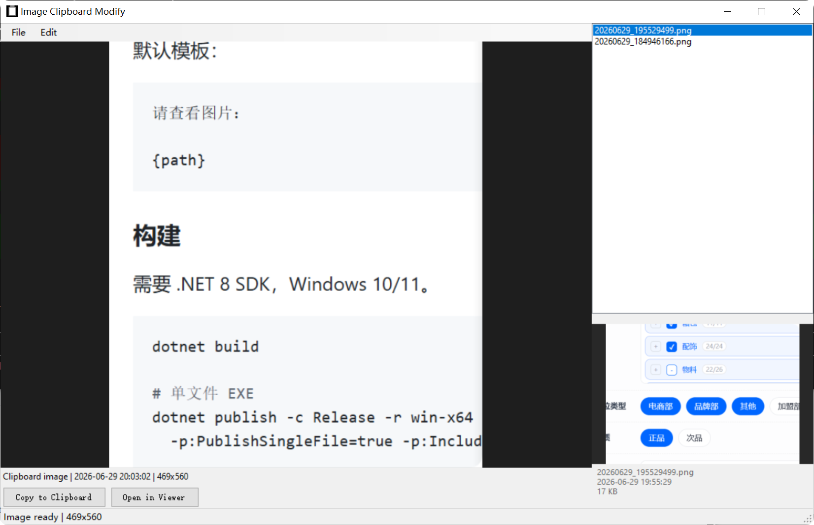

# ImageClipboardModify

[English](#english) | [中文](#中文)



---

## English

A lightweight Windows tray utility that saves clipboard images to disk and copies a customizable text (with the image path) back to the clipboard.

### How It Works

```
Copy an image anywhere (Ctrl+C)
        ↓
ImageClipboardModify detects it and shows a preview
        ↓
Click "Copy to Clipboard"
        ↓
Image saved to disk + custom text (with path) copied to clipboard
        ↓
Paste anywhere
```

### Features

- **Clipboard Monitoring** — Auto-detects when an image is copied, zero configuration
- **Image Preview** — See the clipboard image before saving
- **Save + Custom Text** — Saves image to disk and copies user-defined text containing the path
- **Open in Viewer** — Open image in your default system image viewer
- **History Panel** — Browse and reuse previously saved images
- **Configurable Template** — Customize the output text format
- **Auto Startup** — Optional Windows startup via registry (no admin needed)
- **System Tray** — Minimize to tray, runs in background

### Template Variables

| Variable | Description |
|---|---|
| `{path}` | Full file path |
| `{filename}` | Filename with extension |
| `{filename_no_ext}` | Filename without extension |
| `{dir}` | Directory path |
| `{date}` | Current date (yyyy-MM-dd) |
| `{time}` | Current time (HH:mm:ss) |

Default template:

```
请查看图片：

{path}
```

### Build

Requires .NET Framework 4.8 SDK or Visual Studio on Windows 10/11.

```bash
dotnet build
dotnet publish -c Release
```

Output: `bin/Release/net48/publish/ImageClipboardModify.exe`

No runtime dependency — .NET Framework 4.8 is built into Windows 10 1703+ and Windows 11.

### License

[MIT](LICENSE)

---

## 中文

轻量级 Windows 托盘工具：把剪切板里的图片保存到本地，并把自定义文字（包含图片路径）写回剪切板。

### 使用流程

```
任意位置复制图片（Ctrl+C）
        ↓
ImageClipboardModify 自动检测并显示预览
        ↓
点击「Copy to Clipboard」
        ↓
图片保存到本地 + 自定义文字（含路径）写入剪切板
        ↓
粘贴到任意位置
```

### 功能

- **剪切板监听** — 自动检测图片复制，零配置
- **图片预览** — 保存前先看清楚
- **本地存储 + 自定义文字** — 图片落盘，并把用户自定义的文字（含路径）写入剪切板
- **外部打开** — 用系统默认图片查看器打开
- **历史记录** — 右侧面板浏览和复用已保存图片
- **可配置模板** — 自定义输出文字格式
- **开机启动** — 可选，写入注册表，无需管理员权限
- **系统托盘** — 最小化到托盘后台运行

### 模板变量

| 变量 | 说明 |
|---|---|
| `{path}` | 完整文件路径 |
| `{filename}` | 文件名（含扩展名） |
| `{filename_no_ext}` | 文件名（不含扩展名） |
| `{dir}` | 目录路径 |
| `{date}` | 当前日期（yyyy-MM-dd） |
| `{time}` | 当前时间（HH:mm:ss） |

默认模板：

```
请查看图片：

{path}
```

### 构建

需要 .NET Framework 4.8 SDK 或 Visual Studio，Windows 10/11。

```bash
dotnet build
dotnet publish -c Release
```

输出：`bin/Release/net48/publish/ImageClipboardModify.exe`

无运行时依赖 — .NET Framework 4.8 已内置于 Windows 10 1703+ 和 Windows 11。

### 开源协议

[MIT](LICENSE)
